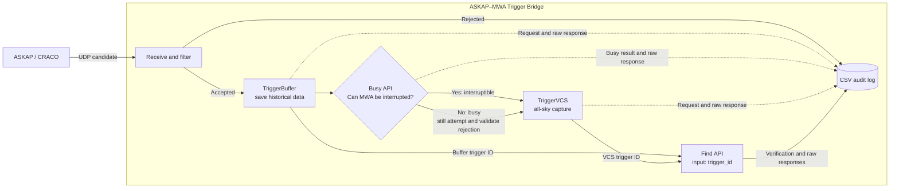

# ASKAP–MWA FRB Rapid-Response Triggering

This service receives CRACO/snoopy candidates over UDP and executes an ordered MWA trigger workflow:



The UDP receiver and HTTP worker run in separate threads so HTTP latency does not block candidate reception.

## MWA API behavior

The implementation follows the official [MWA Triggering web services documentation](https://mwatelescope.atlassian.net/wiki/spaces/MP/pages/24972656/Triggering+web+services):

- `triggerbuffer` inherits pointing, frequency, and other settings from the current (or most recent) observation. It cannot supply a new pointing.
- A finite `start_time` / `end_time` interval is used to save only historical buffer data. By default it starts `--past-seconds` before the candidate GPS time and ends at the candidate GPS time.
- `busy` returns `true` when the project cannot interrupt the schedule during the requested VCS duration.
- `triggervcs` is called without `ra`, `dec`, `source`, `alt`, or `az`. The API defines this as all-sky mode with one dipole active on each tile.
- The VCS call is made even when `busy=true`, so the authoritative trigger response and its error reason are recorded and logged.
- HTTP 2xx alone is not considered success. The service checks the JSON `success` and `errors` fields, then queries `find?trigger_id=...` and checks the recorded trigger mode and success value.

## Candidate format

Each UDP packet must contain one eight-column snoopy candidate:

```text
%0.2f %lu %0.4f %d %d %0.2f %d %0.9f
```

| Field | Type | Description |
|---|---:|---|
| `sn` | float | Signal-to-noise ratio |
| `tfile` | int | Sample number from file start |
| `time_from_file` | float | Seconds from file start |
| `ibc` | int | Boxcar width |
| `idt` | int | DM trial index |
| `dm` | float | Dispersion measure (pc/cm³) |
| `ibeam` | int | Beam number |
| `cand_mjd` | float | Candidate UTC time as MJD |

RA and Dec are not present, so TriggerVCS intentionally uses all-sky mode.

## Run

Create a project-local `.env` file (excluded by `.gitignore`):

```dotenv
TRIGGER_SECURE_KEY=your_secret_here
PROJECT_ID=your_project_id
```

`Project_ID` is accepted for compatibility; `PROJECT_ID` is recommended. Run `chmod 600 .env`. Exported variables take precedence.

```bash
python3 udp_to_triggerbuffer.py 224.1.1.1:4900 \
  --past-seconds 120 \
  --obstime 600 \
  --min-sn 20 \
  --min-dm 100 \
  --burst-window 1 \
  --burst-max-count 10 \
  -v
```

Use `--pretend` for an end-to-end dry run. Note that the MWA trigger API itself defaults `pretend` to true, but this client always sends an explicit true/false value.

For local multicast testing:

```bash
sudo ip route add 224.1.1.1/32 dev lo
```

## Important options

| Argument | Default | Meaning |
|---|---|---|
| `--env-file` | `.env` | Credentials and environment defaults file |
| `--endpoint` | `http://mro.mwa128t.org/trigger/triggerbuffer` | TriggerBuffer URL |
| `--busy-endpoint` | sibling of `--endpoint` | Busy URL |
| `--triggervcs-endpoint` | sibling of `--endpoint` | TriggerVCS URL |
| `--show-endpoint` | `https://ws.mwatelescope.org/trigger/find` | Trigger-history Find lookup URL |
| `--project-id` | `C001` | Interrupting MWA project |
| `--past-seconds` | `120` | Historical buffer interval before candidate time |
| `--use-start-zero` | off | Save everything currently available in the historical buffer |
| `--obstime` | `600` | Busy look-ahead and all-sky VCS `exptime` |
| `--creator` | `askap-mwa-frb-trigger` | Trigger history creator |
| `--obsname` | `ASKAP_FRB` | VCS observation name |
| `--verify-attempts` | `3` | Trigger-history lookup attempts |
| `--verify-delay` | `1.0` | Delay between history lookups |
| `--pretend` | off | Ask MWA to validate without changing the schedule |
| `--min-sn` | `20.0` | Minimum candidate S/N |
| `--min-dm` | `0.0` | Minimum candidate DM |
| `--burst-window` | `1.0` | Burst safeguard window in seconds |
| `--burst-max-count` | `10` | Candidates allowed in the burst window |
| `--min-trigger-interval` | `2.0` | Minimum interval between complete workflows |
| `--debug-url` | unset | Forward parsed candidates to the companion debug receiver |
| `--show-trigger-url` | off | Print full TriggerBuffer/TriggerVCS URLs, including secure key |
| `--trigger-csv` | `trigger_records.csv` | Persistent filtered-candidate and Buffer/VCS audit records |

When using a reverse proxy, set all four endpoint options explicitly if its paths do not match the official `/trigger/{service}` layout.

## Logging and failure behavior

Normal operation and every API-level failure are written through Python logging (and therefore to journald under systemd). Logged failures include:

- HTTP/JSON failures;
- `success=false` and every returned MWA error;
- a missing or invalid `trigger_id`;
- a trigger missing from history;
- a history mode/success mismatch;
- the Busy result associated with a failed VCS attempt.

By default, the secure key and full authenticated request URL are not written to normal logs. `--show-trigger-url` intentionally prints authenticated trigger URLs for manual diagnostics. Server response bodies are stored verbatim in the CSV and may echo sensitive values, so the CSV and its backups are created with mode `0600` and must be handled as confidential runtime data.

## Tests

```bash
python3 -m unittest -v
```

Tests cover every filter rejection path and its CSV record, burst suppression, historical buffer bounds, all-sky VCS parameters, Find queries by `trigger_id`, call ordering, raw response auditing, successful history verification, and the busy/rejected-VCS path.

## Deployment

Install dependencies into a virtual environment. The service loads `.env` from its working directory and optionally loads `/etc/askap-mwa-trigger.env` when present. Adjust the included unit paths and settings for the deployment host.

## Dependencies

- Python 3.12+
- requests 2.32.5+
- astropy 7.2.0+ (recommended for leap-second-aware MJD-to-GPS conversion; a fixed-offset fallback is available)
