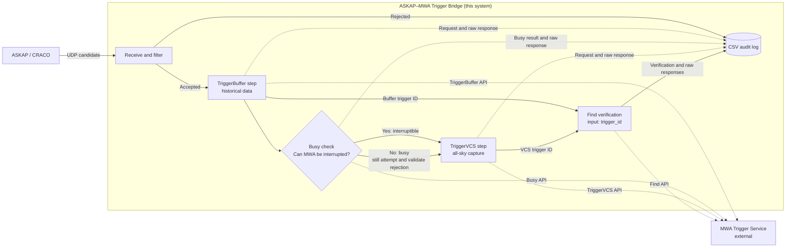

# ASKAP–MWA FRB Rapid-Response Triggering

## 1. System overview

This service receives CRACO/snoopy candidates over UDP and executes an ordered MWA trigger workflow:



Only the ASKAP–MWA Trigger Bridge box is implemented by this repository. TriggerBuffer, Busy, TriggerVCS, and Find inside the box represent local workflow steps; their dotted connections call the external MWA Trigger Service.

The UDP receiver and HTTP worker run in separate threads so HTTP latency does not block candidate reception.

## 2. MWA API behavior

The implementation follows the official [MWA Triggering web services documentation](https://mwatelescope.atlassian.net/wiki/spaces/MP/pages/24972656/Triggering+web+services):

- `triggerbuffer` inherits pointing, frequency, and other settings from the current (or most recent) observation. It cannot supply a new pointing.
- A finite `start_time` / `end_time` interval is used to save only historical buffer data. By default it starts `--past-seconds` before the candidate GPS time and ends at the candidate GPS time.
- `busy` returns `true` when the project cannot interrupt the schedule during the requested VCS duration.
- `triggervcs` is called without `ra`, `dec`, `source`, `alt`, or `az`. The API defines this as all-sky mode with one dipole active on each tile.
- The VCS call is made even when `busy=true`, so the authoritative trigger response and its error reason are recorded and logged.
- HTTP 2xx alone is not considered success. The service checks the JSON `success` and `errors` fields, then queries `find?trigger_id=...` and checks the recorded trigger mode and success value.

## 3. `--pretend` versus a real trigger

This client always sends an explicit `pretend` value to both `triggerbuffer` and `triggervcs`. Do not rely on the MWA API's own default.

| Behaviour | With `--pretend` | Without `--pretend` |
|---|---|---|
| Value sent to TriggerBuffer and TriggerVCS | `pretend=true` | `pretend=false` |
| UDP reception and local S/N, DM, burst, and rate-limit filters | Active | Active |
| Calls to TriggerBuffer, Busy, TriggerVCS, and Find | Made in the normal order | Made in the normal order |
| Authentication and request validation | Performed | Performed |
| MWA schedule | Existing observations are not cleared and new observations are not scheduled | May be interrupted or changed according to project permissions and MWA state |
| MWA data capture | No real buffer/VCS observation is scheduled | Historical buffer data is saved and an all-sky VCS observation is requested |
| Returned observation IDs | May be dummy IDs | IDs refer to observations actually requested |
| Logs and `trigger_records.csv` | Written | Written |

`--pretend` is therefore an end-to-end validation mode, not a mode that avoids the MWA APIs. A successful pretend response means that the request passed the service checks; it does not mean that MWA data was captured.

Without `--pretend`, an accepted CRACO candidate can cause real MWA actions. In this service the real workflow is:

1. `triggerbuffer` saves the configured historical interval ending at the candidate time.
2. `busy` checks whether the project can interrupt the upcoming schedule.
3. `triggervcs` requests a real all-sky voltage capture. It is attempted even when `busy=true`, so the authoritative rejection or success is recorded.
4. `find` verifies each returned trigger ID, and the complete audit is written to CSV.

Only remove `--pretend` after the MWA project ID, secure key, filtering thresholds, multicast input, timestamps, and pretend responses have all been checked. Never run pretend and real bridge processes on the same UDP input at the same time.

## 4. Candidate format

Each UDP packet must contain one eight-column snoopy candidate:

```text
%0.2f %lu %0.4f %d %d %0.2f %d %0.9f
```

| Field | Type | Description |
|---|---:|---|
| `sn` | float | Signal-to-noise ratio |
| `tfile` | int | Sample number from file start |
| `time_from_file` | float | Seconds from file start |
| `ibc` | int | Boxcar width |
| `idt` | int | DM trial index |
| `dm` | float | Dispersion measure (pc/cm³) |
| `ibeam` | int | Beam number |
| `cand_mjd` | float | Candidate UTC time as MJD |

RA and Dec are not present, so TriggerVCS intentionally uses all-sky mode.

## 5. Dependencies

- Python 3.12+
- requests 2.32.5+
- astropy 7.2.0+ (recommended for leap-second-aware MJD-to-GPS conversion; a fixed-offset fallback is available)

## 6. Quick start

Create a project-local `.env` file (excluded by `.gitignore`):

```dotenv
TRIGGER_SECURE_KEY=your_secret_here
PROJECT_ID=your_project_id
```

`Project_ID` is accepted for compatibility; `PROJECT_ID` is recommended. Run `chmod 600 .env`. Exported variables take precedence.

```bash
python3 udp_to_triggerbuffer.py 224.1.1.1:4900 \
  --past-seconds 120 \
  --obstime 600 \
  --min-sn 20 \
  --min-dm 100 \
  --burst-window 1 \
  --burst-max-count 10 \
  --pretend \
  -v
```

The command above uses pretend mode. To enable real triggering, use the same reviewed command without `--pretend`. The absence of the flag is the only pretend/real switch in this client.

For local multicast testing:

```bash
sudo ip route add 224.1.1.1/32 dev lo
```

## 7. Deployment alongside ASKAP/CRACO

### Deployment location

Deploy this bridge on the ASKAP host that runs the CRACO candidate service, or in the same service environment with direct access to its candidate UDP stream. It is an ASKAP-side companion to CRACO; it is not deployed on an MWA processing host.

The deployment host must:

- receive the CRACO UDP multicast group `224.1.1.1:4900` or the configured unicast stream;
- reach the MWA TriggerBuffer, Busy, TriggerVCS, and Find HTTP endpoints;
- have a synchronized system clock, because candidate MJD values are converted to GPS seconds;
- provide restricted persistent storage for `trigger_records.csv`;
- run only one active bridge for a given candidate stream.

### Step 1: install the repository on the CRACO service host

```bash
cd /home/ubuntu
git clone git@github.com:wangliwfsd/askap-mwa-frb-trigger.git
cd askap-mwa-frb-trigger
```

If the repository already exists, update it through the site's normal release process instead of cloning it again.

### Step 2: prepare Python

A dedicated virtual environment keeps the bridge dependencies separate from CRACO:

```bash
cd /home/ubuntu/askap-mwa-frb-trigger
python3 -m venv .venv
.venv/bin/python3 -m pip install --upgrade pip
.venv/bin/python3 -m pip install -r requirements.txt
```

The recorded Oracle test used `/home/ubuntu/craco-python/venv/bin/python3`. That tested interpreter may be retained if sharing the CRACO environment is intentional; otherwise update the systemd `ExecStart` path to the dedicated `.venv` shown above.

### Step 3: configure credentials

Create the systemd environment file with a private editor:

```bash
sudoedit /etc/askap-mwa-trigger.env
```

Its contents are:

```dotenv
TRIGGER_SECURE_KEY=replace_with_the_authorized_mwa_key
PROJECT_ID=replace_with_the_authorized_mwa_project_id
```

Restrict it and confirm that no credential file is tracked by Git:

```bash
sudo chmod 600 /etc/askap-mwa-trigger.env
git status --short
```

Do not place the secure key in the source, service command, README, or shared logs. `PROJECT_ID` is preferred; `Project_ID` remains accepted for compatibility.

### Step 4: verify the service settings

Review `udp-to-triggerbuffer.service` before installing it. At minimum, confirm:

- `User` and `WorkingDirectory` match the CRACO host;
- `EnvironmentFile` is `/etc/askap-mwa-trigger.env`;
- `ExecStart` uses the selected Python environment;
- the UDP address and port match CRACO;
- `--past-seconds`, `--obstime`, S/N, DM, burst, and rate-limit values are approved;
- the service user can write `trigger_records.csv` in the working directory.

If the site uses a proxy or nonstandard endpoint paths, add all four reviewed options:

```text
--endpoint URL --busy-endpoint URL --triggervcs-endpoint URL --show-endpoint URL
```

### Step 5: validate in pretend mode

Load the protected environment into a private shell:

```bash
set -a
source /etc/askap-mwa-trigger.env
set +a
```

Run the bridge in the foreground. This example uses the dedicated environment; substitute the CRACO Python path if that is the selected deployment:

```bash
/home/ubuntu/askap-mwa-frb-trigger/.venv/bin/python3 \
  /home/ubuntu/askap-mwa-frb-trigger/udp_to_triggerbuffer.py \
  224.1.1.1:4900 \
  --past-seconds 120 \
  --obstime 600 \
  --min-sn 20 \
  --min-dm 100 \
  --burst-window 1 \
  --burst-max-count 10 \
  --workers 1 \
  --pretend \
  -v
```

Send or wait for a known CRACO candidate. The Oracle integration-test section below provides a reproducible `snoopy_sender.py` command.

Before proceeding, confirm:

- the process joins the intended UDP address and receives candidates;
- expected candidates pass the filters;
- logs show `pretend=true` for TriggerBuffer and TriggerVCS;
- TriggerBuffer, Busy, TriggerVCS, and Find return the expected results;
- candidate timestamps and historical buffer bounds are correct;
- `trigger_records.csv` contains the two expected audit rows;
- no real MWA observation was scheduled.

Stop the foreground process with Ctrl+C.

### Step 6: obtain approval for real triggering

Real mode can alter the MWA schedule and request data capture. Confirm the operational window and authorization with the relevant ASKAP/CRACO and MWA operators. Record the approved project, thresholds, buffer interval, VCS duration, endpoints, and operator contact procedure.

### Step 7: install and start the systemd service

The included unit is configured for real triggering because its `ExecStart` does not contain `--pretend`. Only install it after Step 6.

After reviewing and adjusting the local unit file:

```bash
sudo install -m 644 udp-to-triggerbuffer.service \
  /etc/systemd/system/udp-to-triggerbuffer.service
sudo systemctl daemon-reload
sudo systemctl enable --now udp-to-triggerbuffer.service
```

Verify the effective unit and ensure `--pretend` is absent only when real triggering is intended:

```bash
sudo systemctl cat udp-to-triggerbuffer.service
sudo systemctl status udp-to-triggerbuffer.service
```

When `--pretend` is absent, the script explicitly sends `pretend=false`. This is a real MWA trigger configuration.

### Step 8: monitor and operate the service

```bash
sudo journalctl -u udp-to-triggerbuffer.service -f
stat -c '%a %n' trigger_records.csv
tail -n 2 trigger_records.csv
```

For every accepted real candidate, expect TriggerBuffer and TriggerVCS audit rows with corresponding Find verification. Investigate `success=false`, missing trigger IDs, history mismatches, or repeated restarts before leaving the service unattended. CSV rows can contain raw server responses, so inspect them only in a private terminal.

Routine controls are:

```bash
sudo systemctl stop udp-to-triggerbuffer.service
sudo systemctl start udp-to-triggerbuffer.service
sudo systemctl restart udp-to-triggerbuffer.service
```

To return to pretend mode, stop the real systemd service first and run the Step 5 foreground command. Never run pretend and real bridge processes against the same UDP stream simultaneously.

## 8. Logging and failure behavior

Normal operation and every API-level failure are written through Python logging (and therefore to journald under systemd). Logged failures include:

- HTTP/JSON failures;
- `success=false` and every returned MWA error;
- a missing or invalid `trigger_id`;
- a trigger missing from history;
- a history mode/success mismatch;
- the Busy result associated with a failed VCS attempt.

By default, the secure key and full authenticated request URL are not written to normal logs. `--show-trigger-url` intentionally prints authenticated trigger URLs for manual diagnostics. Server response bodies are stored verbatim in the CSV and may echo sensitive values, so the CSV and its backups are created with mode `0600` and must be handled as confidential runtime data.

## 9. Testing and verification

### Unit tests

```bash
python3 -m unittest -v
```

Tests cover every filter rejection path and its CSV record, burst suppression, historical buffer bounds, all-sky VCS parameters, Find queries by `trigger_id`, call ordering, raw response auditing, successful history verification, and the busy/rejected-VCS path.

### Recorded pretend integration test on the Oracle host

A pretend integration test was completed on the Oracle `askap-triggering` host on 2026-07-21. It used the CRACO `snoopy_sender.py` from `/home/ubuntu/craco-python` to send one candidate over loopback to the bridge while the bridge was listening on the CRACO multicast port.

The test credentials were supplied through the bridge's local `.env`; no key is included here. Start the bridge in the first terminal:

```bash
/home/ubuntu/craco-python/venv/bin/python3 \
  /home/ubuntu/askap-mwa-frb-trigger/udp_to_triggerbuffer.py \
  224.1.1.1:4900 \
  --pretend \
  --min-sn 12.3 \
  --obstime 180 \
  -v
```

The actual diagnostic run also used `--show-trigger-url`. That option prints `secure_key` in plaintext and must only be used with test credentials in a private terminal; do not enable it in a service or retain its output in shared logs.

In a second terminal, calculate a current MJD and send a snoopy candidate:

```bash
CURRENT_MJD=$(/home/ubuntu/craco-python/venv/bin/python3 -c \
  'from astropy.time import Time; print(Time.now().mjd)')

/home/ubuntu/craco-python/venv/bin/python3 \
  /home/ubuntu/craco-python/src/craco/snoopy_sender.py \
  --snr 12.3 \
  --total_sample 123456 \
  --obstime_sec 10.5 \
  --boxc_width 4 \
  --dm 300 \
  --dm_pccm3 299 \
  --ibeam 7 \
  --mjd "$CURRENT_MJD" \
  --host 127.0.0.1 \
  --port 4900
```

The sender emitted this eight-column candidate:

```text
12.30 123456 10.500 4 300 299.0 7 61242.101693743
```

The bridge accepted the candidate at the exact `--min-sn 12.3` boundary and completed the pretend workflow:

| Check | Observed result |
|---|---|
| Candidate | Accepted with S/N `12.30`, DM `299.00`, beam `7` |
| TriggerBuffer | `pretend=true`, success, trigger ID `71660`, history mode `BUFFER` verified |
| Busy | `false`; project `T001` was reported interruptible for the requested interval |
| TriggerVCS | `pretend=true`, `exptime=180`, `nobs=1`, success, trigger ID `71661` |
| TriggerVCS history | Mode `MWAX_VCS`, `pretend=true`, and success verified |
| Real MWA observation | Not scheduled, because both trigger calls used pretend mode |

The observation IDs returned by a successful pretend request are dummy IDs and do not indicate captured data.

The run also created or appended to:

```text
/home/ubuntu/askap-mwa-frb-trigger/trigger_records.csv
```

For this accepted candidate, the CSV received one `triggerbuffer` audit row and one `triggervcs` audit row. Each row contains the safe request parameters, trigger ID, API result, raw API exchanges, and Find verification. The secure key is excluded from request parameters, but raw server response bodies may still contain sensitive information; keep the file at mode `0600` and do not commit or share it.

Useful checks after the test are:

```bash
stat -c '%a %n' trigger_records.csv
tail -n 2 trigger_records.csv
```

The second command may display raw server responses. Run it only in a private terminal.

## 10. Command-line options reference

| Argument | Default | Meaning |
|---|---|---|
| `--env-file` | `.env` | Credentials and environment defaults file |
| `--endpoint` | `http://mro.mwa128t.org/trigger/triggerbuffer` | TriggerBuffer URL |
| `--busy-endpoint` | sibling of `--endpoint` | Busy URL |
| `--triggervcs-endpoint` | sibling of `--endpoint` | TriggerVCS URL |
| `--show-endpoint` | `https://ws.mwatelescope.org/trigger/find` | Trigger-history Find lookup URL |
| `--project-id` | `C001` | Interrupting MWA project |
| `--past-seconds` | `120` | Historical buffer interval before candidate time |
| `--use-start-zero` | off | Save everything currently available in the historical buffer |
| `--obstime` | `600` | Busy look-ahead and all-sky VCS `exptime` |
| `--creator` | `askap-mwa-frb-trigger` | Trigger history creator |
| `--obsname` | `ASKAP_FRB` | VCS observation name |
| `--verify-attempts` | `3` | Trigger-history lookup attempts |
| `--verify-delay` | `1.0` | Delay between history lookups |
| `--pretend` | off | Send `pretend=true`; validate the complete workflow without clearing or adding MWA observations |
| `--min-sn` | `20.0` | Minimum candidate S/N |
| `--min-dm` | `0.0` | Minimum candidate DM |
| `--burst-window` | `1.0` | Burst safeguard window in seconds |
| `--burst-max-count` | `10` | Candidates allowed in the burst window |
| `--min-trigger-interval` | `2.0` | Minimum interval between complete workflows |
| `--debug-url` | unset | Forward parsed candidates to the companion debug receiver |
| `--show-trigger-url` | off | Print full TriggerBuffer/TriggerVCS URLs, including secure key |
| `--trigger-csv` | `trigger_records.csv` | Persistent filtered-candidate and Buffer/VCS audit records |

When using a reverse proxy, set all four endpoint options explicitly if its paths do not match the official `/trigger/{service}` layout.
